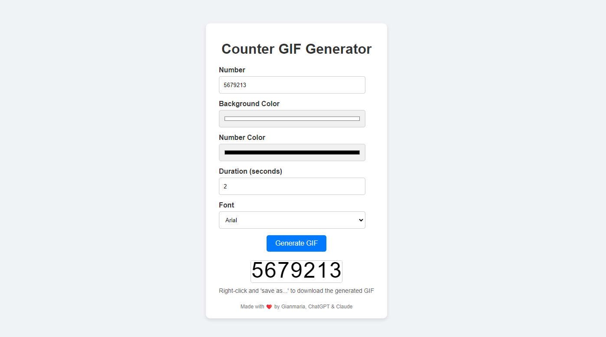

# Counter GIF Generator

The Counter GIF Generator is a web application that works only on client side and lets you create counter animation GIF that will scroll until reaching the target number.

You can personalize it:
- Target number
- Background color
- Font color
- Font size
- Animation duration

This is especially useful for generating animations to be inserted into PPT presentations (or at least I generate this for myself with this use).

In the past, I created something similar directly on PPT, with built-in animation capabilities, but it was harder to maintain and edit (you can find the example PPT in the "useful" folder), so I was looking for something that would let me build this kind of animation faster and wanted to try ouy ChatGPT and Claude's coding capabilities.

## Usage
- Alternative 1 - you can find the ready to use web application here [Counter GIF Generator](https://counter-gif-generator.pages.dev/)
- Alternative 2 - you can self host running `npm start` from the repo folder
- Alternative 3 - download and host on your preferred hosting solution

## License
Feel free to fork and/or use as you wish